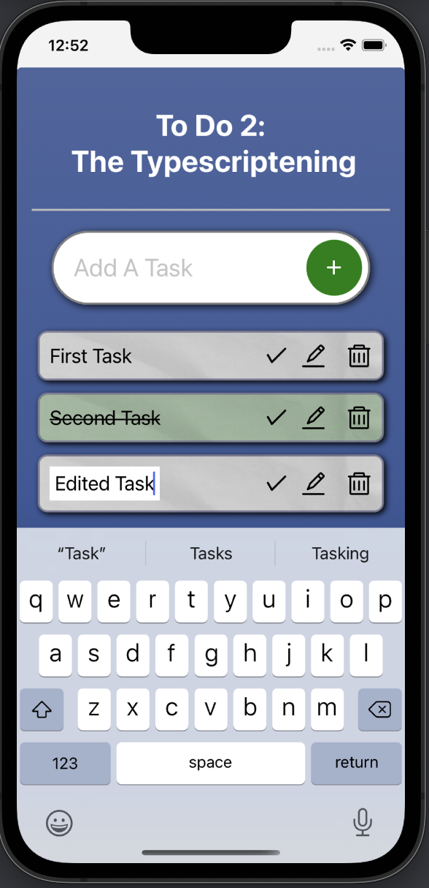

# To Do 2: The Typescriptening

***Duration: 2 day sprint***

## Description

A client-side only to-do list built to explore and experiment with React-Native and Typescript. Tasks can be added, removed, marked complete, and edited.

## Screenshots

## Prerequisites
- Node.js
- An Xcode OR Android Studio development environment

## Get Started
1. In terminal, run `npm install` to acquire dependencies
2. For iOS: run `pod install`
3. Start metro server with `npx react-native start`
4. `npx react-native run-ios` or `npx react-native run-android` (you may need to boot the respective emulator first)

## Usage
1. Type a task in the input field and press the '+' to add it to the task list.
2. Press the checkmark icon to mark a task as complete.
3. Press the pencil icon to automatically set focus to a textfield that allows editing of the task name.
4. Press the trash icon to delete a task from the list.

## Acknowledgements
[Wrinkled Paper](https://unsplash.com/photos/_kUxT8WkoeY) texture provided with cc0 by Marjan Blan via Unsplash.